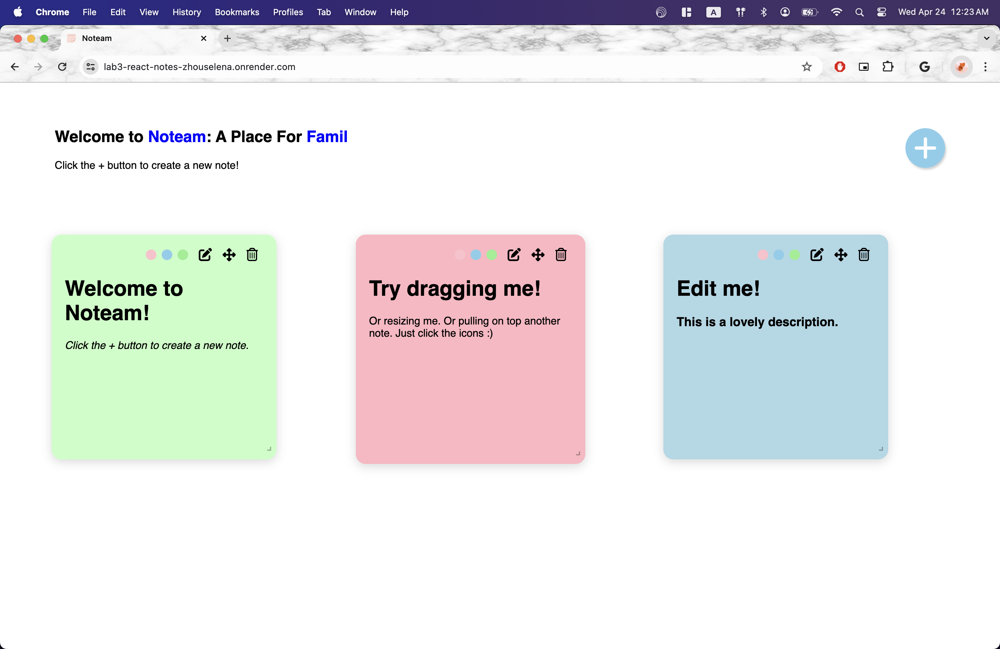
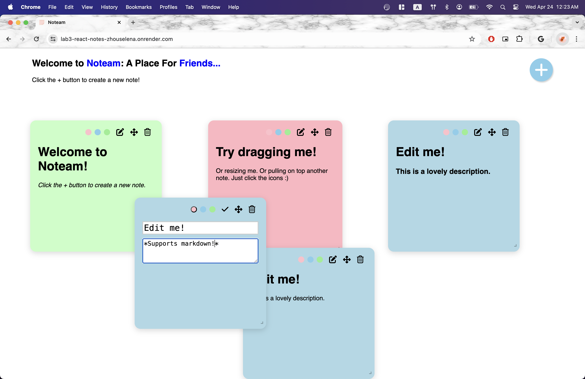

# Noteam

_Noteam_ is a collaborative notes app where users can post stickies and watch as others write notes in real time. _Noteam_ supports markdown and serves as a fun alternative to other common notes apps.

[deployed url](https://noteam.onrender.com/)

## What Worked Well

- Functionality: I was able to make the app as functional as I was envisioning, complete with resizing, color changing, and layering. For the most part the app feels pretty intuitive.
- The icon implementation made the app look more professional, and was a lot more straightforward than I expected.
- I got a much greater understanding of how hooks/states/components work in React, and I think I finally understand how everything flows together. I know how to properly use props now!
- The Firebase worked super well and was a lot more straightforward than I was expecting as well! It was really cool using backend on any scale, and the datastore.js actually made the rest of my code less complicated and easy to read.

## What Didn't

- This ended up working, but I spent a long time on it so it's going in this section - relative positioning of the notes! After reading hours of docs & stackoverflow, I finally understand that Draggable uses translate to position the child divs. For the longest time, my notes would change position or move to a different place if another note was resized or added or deleted. I finally figured it out but this was def the most frustrating part of the lab.
- Autoresizing. I wanted the note to autoresize to fit the text, but couldn't figure out how to maintain the aspect ratio I wanted to maintain without the note getting too big or too small. I ultimately chose to do scrolling instead of autoresizing, and implemented the manual resizing feature.

## Features I'm proud of

- z-index sorting that calculates the number of notes, and decrements the z-index of all notes with a greater z-index than the current note.
- color changing functionality for the notes
- resizable notes (with a min & max cap to ensure the user can't get too crazy with the sizing!)

## Screenshots

> Markdown functionality, z-index sorting, color changing